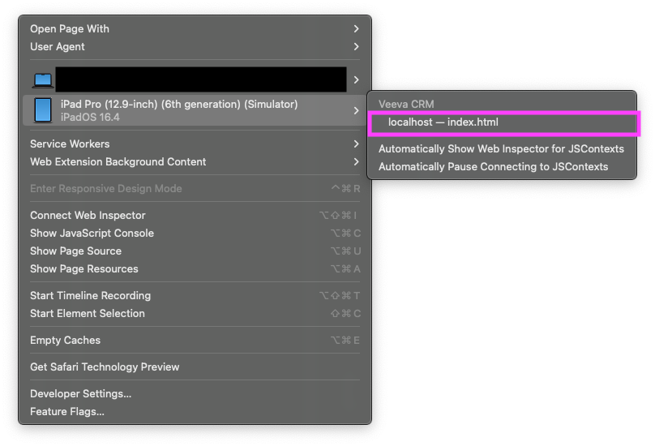
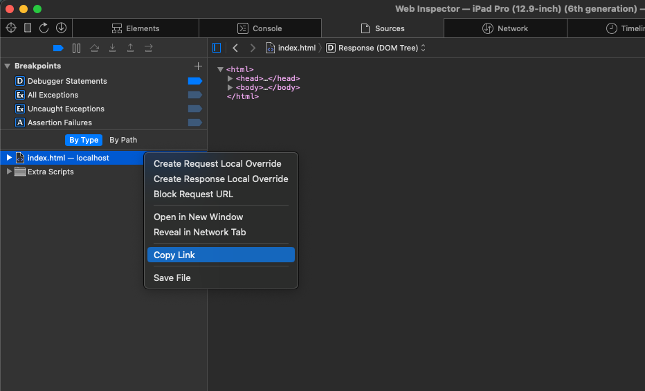

# Veeva iOS Simulator Multi-Channel Slide (MCS) Finder

This is a simple bash script that allows you to locate the directory in your Mac for a Veeva multichannel slide in the Veeva iOS Simulator.

This is useful for developers who need to test a specific slide in the Veeva iOS simulator app without having to re-upload the slide to Veeva Vault and having to wait for it to be processed back into the simulator.

## Requirements

- MacOSX 14.0 or higher
- Xcode
- iOS Simulator
- Veeva iOS simulator app installed on your iOS Simulator

## Installation

Simply download the [find-veeva-mcs.sh](./find-veeva-mcs.sh) from this repo onto your Mac.

## How to Use

### Safari Web Inspector

**While the Veeva iOS simulator is running**, open the slide you want the path for. Then open Safari and from the menu bar select `Develop` > `{iPad device name}` > `localhost - {filename}.html` as shown in the screenshot below.



### HTML URL Link

Once you have opened the web inspector in **Safari**, go to the Sources tab and **right click** on the HTML file and select `Copy Link` as shown in the screenshot below.



### Terminal

Now in your terminal, run the following command and paste in the `{URL}` from the previous step:

```bash
sh find-veeva-mcs.sh {URL}
```

The bash script will open the directory in Finder that contains all the files for the slide for you to modify locally.

### Making Local Changes

Now open the directory in your favorite code editor and make the changes you need.

**There is no live reloading when making changes**. Therefore, you will need to reload the slide in your iOS simulator. To do this you can reload the slide by clicking on the slide in the [navigation bar](https://crmhelp.veeva.com/doc/Content/CRM_topics/Multichannel/CLM/DefaultFunct/DisplayingPres/NavigateCLM.htm#UsingtheNavigationBar).

## Important Notes

- Once you make changes to the directory, ensure you apply the changes to the original source code as well and re-upload accordingly. As the changes only apply to your iOS simulator and not for other people (simulator or actual iOS device).

## Author

Jayvin Duong
